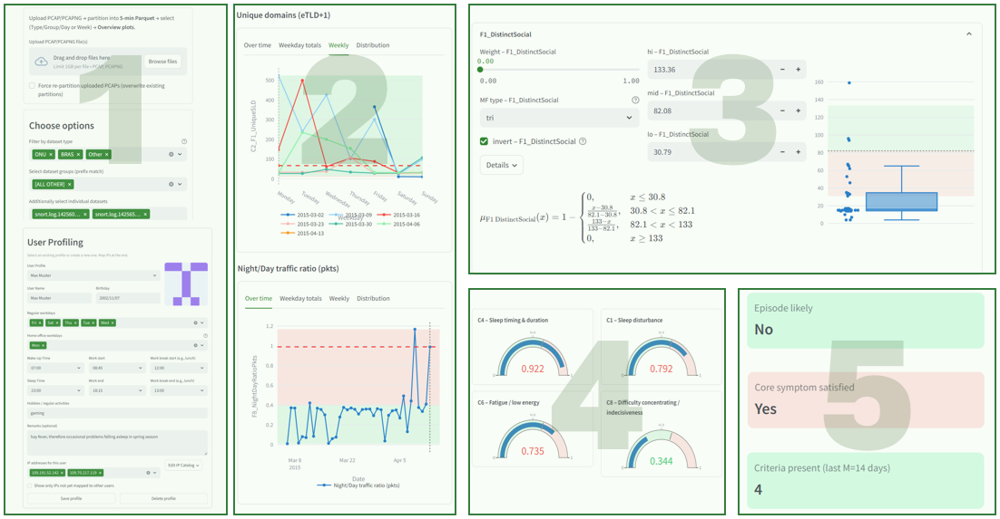
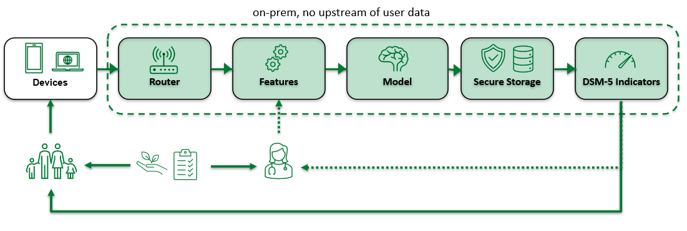
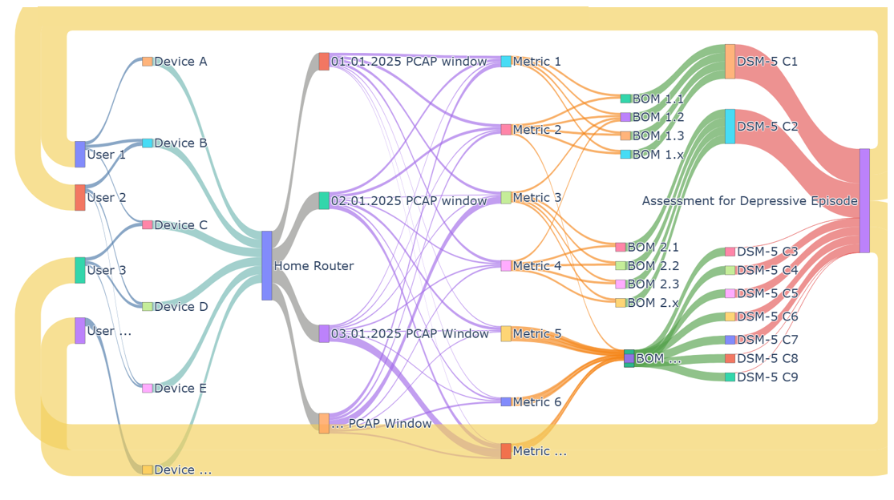
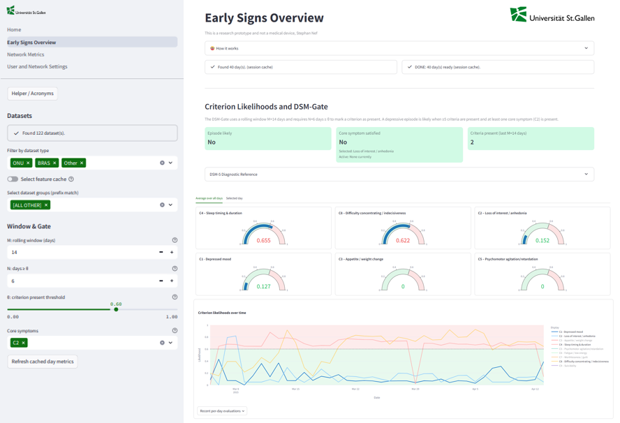
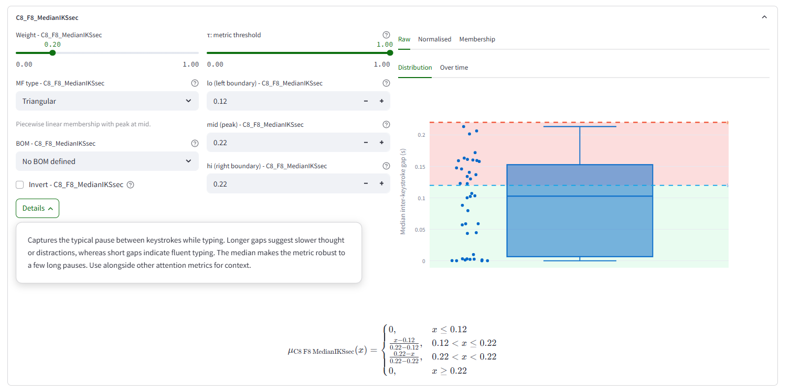

# CareNet Application
### mental health awareness through network traffic insights


This directory contains the application that powers the Router-Centric Behavioral Signals Prototype documented in `../README.md`.

**Important:** This application is a research prototype created for the Master thesis **Digital and Environmental Signals, Passive Sensing for Early Depression Detection** (University of St. Gallen, Stephan Nef). It must not be used for diagnosis, medical decision-making, or emergency escalation.

## Live deployment and further reading

- Hosted build: https://unisg-nef.streamlit.app/ (ask for login credentials: stephan.nef@student.unisg.ch or deploy it locally)

## Page Overview

- `app/00_Home.py`: Landing page with project context, DSM-5 mapping summary, and links to supporting material.
- `app/pages/01_Early_Signs_Overview.py`: Daily Behaviour Observation Metric (BOM) status tiles, per-criterion explanations, and timeline plots.
- `app/pages/02_Network_Metrics.py`: Exploratory views on network activity, night/day balances, domain diversity, and modality mixes derived from five-minute windows.
- `app/pages/03_User_and_Network_Settings.py`: Profile management, dataset selection, and configuration helpers for the Fuzzy Additive Symptom Likelihood (FASL) gate.
- `app/pages/how_it_works_en.md`: In-app documentation that mirrors the narrative used throughout the thesis.

Supporting modules live under:

- `app/metrics/`: Feature engineering logic for DSM-5 criteria, behaviour grouping, and helper utilities.
- `app/utils/`: Shared support functions (data loading, caching, plotting utilities).

## Visual Walkthrough







## In-app Snapshots





## Running the App locally

### Docker Workflow (mirrors production deployment)

```bash
docker compose up --build
```

Run the command from this `app/` directory. The container exposes Streamlit on http://localhost:8501 and mounts `.streamlit/` read-only so the credentials in `secrets.toml` remain on the host.

### Virtual Environment Workflow

```bash
python -m venv ..\.venv
..\.venv\Scripts\activate
pip install -r requirements.txt
streamlit run 00_Home.py
```

Notes:
- Install the repository-level requirements (`pip install -r ../requirements.txt`) if you plan to run ancillary scripts outside the app.
- Set `SCAPY_USE_LIBPCAP=no` when libpcap is not available; the app only reads from files and does not require raw interface capture.

## Configuration Touchpoints

- `app/fasl_config.json`: Central definitions for FASL weights, membership functions, thresholds, and DSM-style gate windows.
- `app/.streamlit/config.toml`: Streamlit theme and layout options.
- `app/.streamlit/secrets.toml`: Username/password pair for the lightweight login guard.
- `app/metrics/metrics_catalog.xlsx`: Human-readable catalogue that maps engineered features to DSM-5 criteria and is rendered on the home page.

## Data Directories

- `app/processed_parquet/`: On-demand storage for five-minute parquet partitions derived from uploaded PCAP/PCAPNG files.
- `app/feature_cache/`: Daily metric caches that accelerate repeat visits by avoiding recomputation.

Both folders are created lazily by the application and can be cleared safely if you want to reset cached artefacts.

## Development Tips

- Use the sample datasets referenced in the thesis to validate behaviour changes after adjusting thresholds.
- When iterating on metric logic, disable caching via the in-app controls or clear `app/feature_cache/` to ensure fresh computations.
- Keep credentials out of version control; `app/.streamlit/secrets.toml` is ignored via `app/.gitignore` but review before publishing forks.

## Safety Reminder

The insights exposed by this application are intended to foster early, empathetic conversations. They are not diagnostic labels and must always be interpreted by qualified professionals within an ethical data-governance framework.
